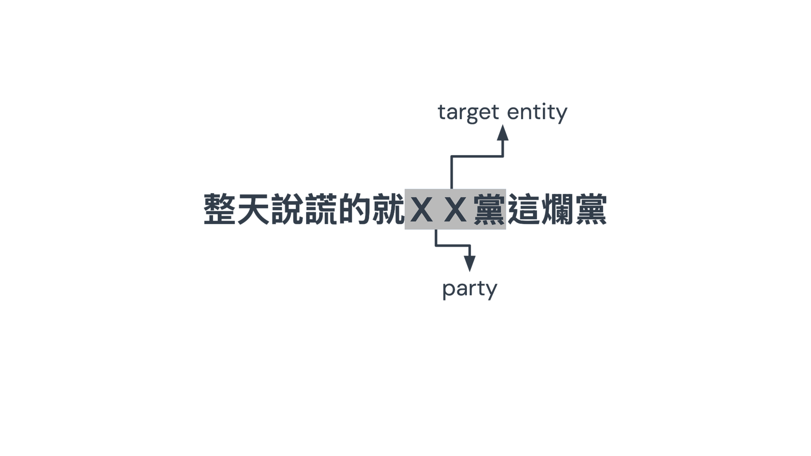
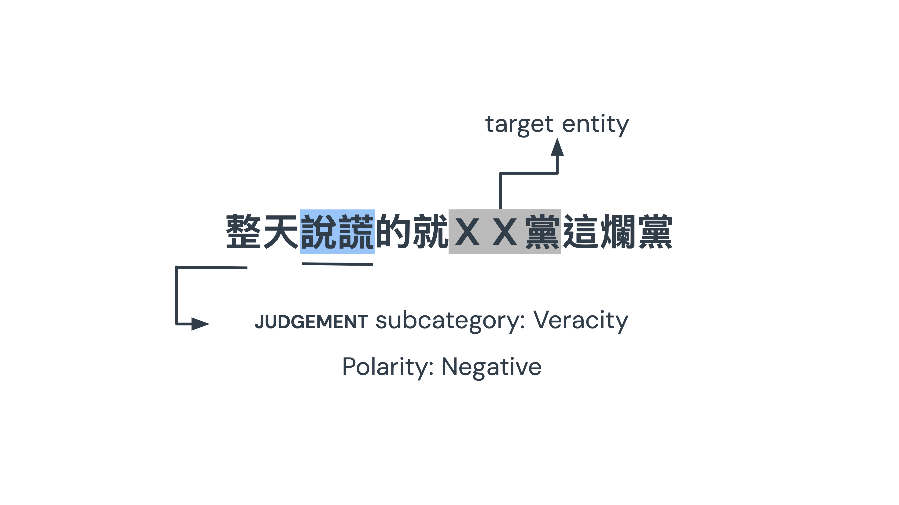
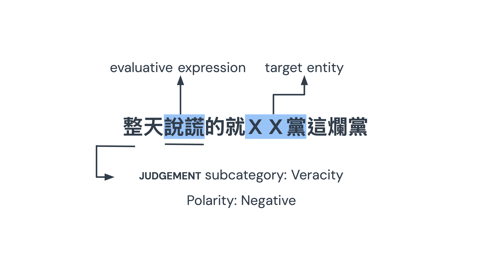
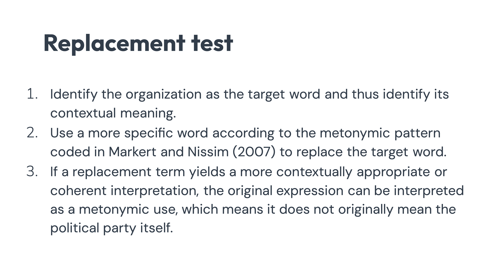
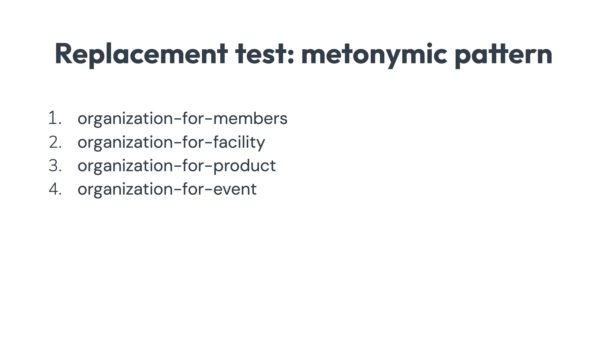
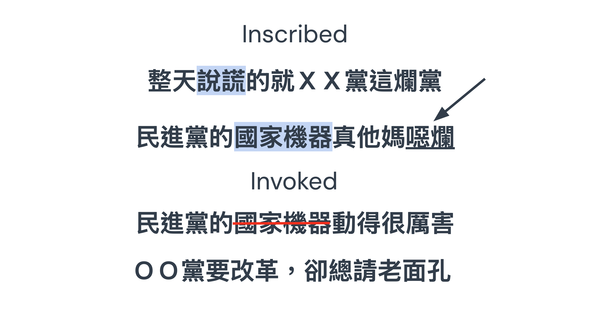

<!-- _class: lead -->

<!-- Good afternoon everyone. My name is Hao‑Yun Chuang. Today I will be presenting my study Evaluations of Political Judgements: A Corpus-Based Appraisal Analysis of Online Comments on the Taiwan 2024 Presidential Election and its Utility for LLM Implementation.   -->

#### Evaluations of Political Judgements: A Corpus-Based Appraisal Analysis of Online Comments on the Taiwan 2024 Presidential Election and its Utility for LLM Implementation

Hao-Yun Chuang  
Graduate Institute of Linguistics, NCCU  
18 November 2025

---
<!-- Let me begin with the online political comments and its nature.  
On platforms like PTT, people like to discuss and criticize to the topics related to the politics, so political comments such as ‘腐化的Ａ黨’ are common on ptt. Within these comments, A 黨 usually functions as cognitive shortcuts, shaping how people perceive entire parties rather than just individual political figure. Therefore, this study will focus on how people evaluate parties.  
Political comments can spread rapidly, remain anonymous, emerge from grassroots sources, and display considerable diversity, making them a valuable resource for analyzing public opinion within political discourse. -->
<!--_paginate: true-->
## Online Political Comment
- 「腐化的Ａ黨」→ political comment
- Political party as an cognitive shortcut
→ people tend to evaluate political party (Gastil, 2014)
- Characteristics
  - Immediacy and rapid dissemination
  - Anonymity and grassroot nature
  - Diversity and large scale

---
<!-- Let's look back to the very first example in the previous slide. 腐化的Ａ黨, this is typically classified to a negative comment because of 腐化; however, it's actually an evaluation of morality. While most NLP research on analyzing such public opinion has mostly focused on polarity exploration — whether a comment is positive or negative - the dimension of what character or behavior of political party is evaluated could be overlooked. Besides evaluation of morality, it could also overlook evaluative dimensions such as competence, or honesty. Therefore, my study argues that we need fine‑grained categories to understand how party are evaluted in the online political discourse.  -->

<!--_paginate: true-->
### Deeper Understanding of the Comment
- 「腐化的Ａ黨」 
 → evaluation of morality
- Research in NLP mostly limits at polarity exploration.
- More fine-grained categories of evaluation are needed.
- It helps understand how political party's image is constructed and challenged.

---

<!-- To address this, I adopt the Appraisal framework proposed by White in 2005. This framework, rooted in Systemic Functional Linguistics, analyzes how language conveys attitudes and evaluations. It provides structured categories that allow us to go beyond simple sentiment and capture nuanced dimensions in the evaluation. -->
<!--_paginate: true-->
#### Appraisal Framework (Martin & White, 2005)

- Derives from Systemic Functional Linguistics (Halliday& Matthiessen, 1994)
- Provides a tool to systematically describe how speakers or writers evaluate through language
- Can be applied commonly in different texts (e.g., politics, media, education)

---
<!-- Within the Appraisal framework, my focus is on the subcategories of Judgement. Judgement is the way language evaluates people and groups, not simply in terms of positive or negative attitudes, but in terms of specific social values. It is divided into five subcategories, each highlighting a different dimension of evaluation.

The first is Capacity, which refers to competence and effectiveness. When someone says, “Ａ黨又沒實力” the criticism is about a lack of skill, resources, or practical ability. In other words, the party is judged as incapable of delivering the expected results, and this is why the phrase “沒實力” directly signals a Capacity judgement.

The second is Propriety, which concerns morality and ethical conduct. When we hear, “Ｂ黨公平公正公開” the evaluation is about whether it acts in line with moral standards. 公平公正公開 are ethical benchmarks, and praising them positions the party as morally credible. This is why Propriety is closely tied to ideas of 公平公正公開.

The third is Veracity, which deals with honesty and truthfulness. If someone says, “Ｃ黨都在說謊” the negative evaluation is about deception. The party is framed as untrustworthy, and the harm lies in misleading the public.

The fourth is Tenacity, which highlights determination and resolve. For example, “Ｄ黨保持從政初心” praises perseverance and steadfastness. The evaluation here is about holding firm to values and enduring challenges, which is seen as admirable persistence.

Finally, we have Normality, which evaluates whether behavior is typical typically expected. When someone says, “Ｅ黨同意才奇怪” the judgement is about deviation from what is considered normal. The party is framed as unusual or unexpected, and that strangeness itself becomes the evaluative expression.

Together, these five subcategories—Capacity, Propriety, Veracity, Tenacity, and Normality—allow us to see not just whether an evaluation is positive or negative, but what kind of evaluative dimension is being asserted.-->
<!--_paginate: true-->
## judgement Subcategories

<table style="width: 100%; text-align: left; border-collapse: collapse; font-size: 32px;">
  <tr style="background-color: #44A6D4; color: white;">
    <th>Subcategory</th>
    <th>What it Evaluates</th>
    <th>Examples from PTT</th>
  </tr>
  <tr>
    <td>Capacity</td>
    <td>competence, intelligence</td>
    <td>A 黨又沒實力！</td>
  </tr>
  <tr>
    <td>Propriety</td>
    <td>morality, ethics</td>
    <td>B 黨最公平公正公開！</td>
  </tr>
  <tr>
    <td>Veracity</td>
    <td>honesty, truthfulness</td>
    <td>C 黨都在說謊！</td>
  </tr>
  <tr>
    <td>Tenacity</td>
    <td>determination, resolve</td>
    <td>D 黨保持從政初心！</td>
  </tr>
  <tr>
    <td>Normality</td>
    <td>unusualness</td>
    <td>E 黨願意才奇怪勒！</td>
  </tr>
</table>

---

<!-- To stress the connection between Judgement subcategories and the politics, Previous studies show that political comments often focus on behavior and character.  
Also, because Appraisal framework relies heavily on context, and in Chinese political contexts, JUDGEMENT has also proven to be especially relevant because it captures accusations of dishonesty, incompetence, or moral failure. So the annotation of the language has become the main issue of the analysis while using this framework. However,-->
<!--_paginate: true-->

## judgement in Political Discourse
- Political comments focus on target's behavior and character (Zappavigna, 2017; Cavasso & Taboada, 2021; L. Li et al., 2025).
- judgement is proven to be the appropriate analytical tool in Chinese political context (L. Li et al., 2025).

---
<!-- Manual annotation of categories in Appraisals is very time‑consuming. So the researchers turned to the model classification. People use traditional machine learning model with lexicon-based method to do the classification. however, it lacks flexibility to the variability of the language. Deep learning models are also tested its capability in annotating appraisal, but it still requires retraining when the context is different, which requires more time. Generative large language models, are more context‑aware, which also fit the nature of the Appraisal framework. By designing prompts, we can guide them to classify evaluative language automatically. So researcher also tries to annotate the Appraisal with instruction-based prompt. That research tries to categorize all categories in the Appraisal framework, which leads to confusion between categories. So this study decides to start from only one attitudinal categorie, which is Judgement, using prompting to see its effect. Moreover, to further investigate the reason behind the evaluation, I also implemented a visualization dashboard to make these evaluations accessible. -->
<!--_paginate: true-->

## Research Gaps
- Manual annotation → inefficient
- Automatic annotation problem
  - Traditional ML (Casey et al., 2005) → lexicon-based
  - Deep learning (Mollá, 2020; Aroyehun & Gelbukh, 2020) → retraining required
  - Generative LLM (Imamovic et al., 2024) → confusion between categories
- Implementation:
  - Visualization of the evaluation

---
<!--My study addresses two main questions:

1.  How do Taiwanese social media users employ evaluative language through JUDGEMENT subcategories to express opinions toward political parties?
2.  How do different prompting strategies — zero‑shot versus few‑shot — influence GPT’s performance in classifying these subcategories?-->
<!--_paginate: true-->
## Research Questions

1. How do Taiwanese social media users employ evaluative language through judgement subcategories within the Appraisal framework to express opinions toward different political parties?
2. How do different prompting strategies (zero-shot vs. few-shot) influence the performance of GPT in classifying judgement subcategories?

---

<!--_paginate: true-->
<!-- And here is the methodology. -->
## **Methodology**

---
<!--_paginate: true-->
<!-- The data of this study comes from the PTT Gossiping board, scraped from January 12, 2023 to January 12, 2024, which is the whole presidential election year before the election day. After filering the keyword, finally 14018 comments were to be annotated. Here is the annotation process.
. -->
## Data Annotation

- **Data:** PTT Gossiping board
- **Date**: 2023.01.12 - 2024.01.12
- **After filtering with keywords**: 14018 comments

---
<!--_paginate: true-->

<!-- let's take 整天說謊的就ＸＸ黨這爛黨 for example, to understand whether it is an evaluation targeting political party, first we have to see the target entity -->

---
<!--_paginate: true-->

<!-- in this example, XX黨 is the target entity. -->

---
<!--_paginate: true-->

<!--  Here because the target of this study actually means political party, however -->

---
<!--_paginate: true-->

<!-- if the target entity contains metonymic expression, for example 李四川包圍 kmt 衝車將軍衝進去, here kmt is political party from the surface, but it actually refers to the headquarter of the kmt.  -->

---
<!--_paginate: true-->

<!-- Metonymic expression like this are excluded from the study. -->

---
<!--_paginate: true-->

<!-- because 說謊 evaluates the truthfulness of the XX 黨, it belongs to the negative evaluation of veracity -->

---
<!--_paginate: true-->

<!-- and therefore the evaluative expression here is 說謊 -->

---
<!-- So here comes the result. -->
# **Results**

---

<!-- The table in the left is the frequency of DPP, in the middle shows the frequency of the judgements in KMT, on the right side shows the results of tpp.  Here the plus symbol represents the positive comments, and the minus symbol means the negative comments. The results show clear differences across parties. To highlight, for the DPP, negative Propriety evaluations dominated, which shows 129 comments. As for the KMT, negative Capacity evaluations were also most frequent, which shows 52 comments.  
The TPP received far fewer evaluations overall, which may due to its newer presence. -->
<!--_paginate: true-->
#### Frequency of judgement 

  

    
<b>DPP</b>

    <table style="width: 100%; text-align: left; border-collapse: collapse;">
      <tr style="background-color: #00A65A; color: white;">
        <th>Subcategory</th><th>+</th><th>−</th>
      </tr>
      <tr><td>capacity</td><td>6</td><td>19</td></tr>
      <tr><td>normality</td><td>0</td><td>9</td></tr>
      <tr><td>propriety</td><td>1</td><td>129</td></tr>
      <tr><td>tenacity</td><td>0</td><td>16</td></tr>
      <tr><td>veracity</td><td>6</td><td>33</td></tr>
      <tr style="font-weight: bold;"><td>Total</td><td colspan="2">213</td></tr>
    </table>
  

  

    
<b>KMT</b>

    <table style="width: 100%; text-align: left; border-collapse: collapse;">
      <tr style="background-color: #005AB5; color: white;">
        <th>Subcategory</th><th>+</th><th>−</th>
      </tr>
      <tr><td>capacity</td><td>5</td><td>52</td></tr>
      <tr><td>normality</td><td>0</td><td>1</td></tr>
      <tr><td>propriety</td><td>0</td><td>17</td></tr>
      <tr><td>tenacity</td><td>2</td><td>5</td></tr>
      <tr><td>veracity</td><td>0</td><td>7</td></tr>
      <tr style="font-weight: bold;"><td>Total</td><td colspan="2">89</td></tr>
    </table>
  

  

    
<b>TPP</b>

    <table style="width: 100%; text-align: left; border-collapse: collapse;">
      <tr style="background-color: #20B2AA; color: white;">
        <th>Subcategory</th><th>+</th><th>−</th>
      </tr>
      <tr><td>capacity</td><td>0</td><td>3</td></tr>
      <tr><td>normality</td><td>0</td><td>0</td></tr>
      <tr><td>propriety</td><td>3</td><td>1</td></tr>
      <tr><td>tenacity</td><td>0</td><td>0</td></tr>
      <tr><td>veracity</td><td>0</td><td>2</td></tr>
      <tr style="font-weight: bold;"><td>Total</td><td colspan="2">9</td></tr>
    </table>
  

---
<!--_paginate: true-->
<!-- And the statistical tests confirmed significant differences.  
For example, CAPACITY evaluations were 13 times more likely to target the KMT than the DPP.  
Meanwhile, PROPRIETY evaluations were 7 times more likely to target the DPP than KMT.  
These findings highlight distinct evaluative patterns pairwise. Moreover, DPP's negative propriety and KMT's negative capacity all show dominant number in contributing the significance in the statistical test. Later we will investigate deeper the reason behind through the visualization dashboard.-->
#### Fisher's Test: judgement subcategories

  <table style="width: 100%; text-align: left; border-collapse: collapse; border-top:3px solid #000000ff; border-bottom:3px solid #000000ff;">
    <tr style="background-color: #ffffffff; color: white; border-bottom:2px solid #000000ff;">
      <th rowspan="2">Subcategory</th>
      <th colspan="2">
        KMT vs 
        TPP
      </th>
      <th colspan="2">
        KMT vs 
        DPP
      </th>
      <th colspan="2">
        TPP vs 
        DPP
      </th>
    </tr>
    <tr style="background-color: #ffffffff; color: white; border-bottom:2px solid #000000ff;">
      <th>OR</th><th><em>p</em></th>
      <th>OR</th><th><em>p</em></th>
      <th>OR</th><th><em>p</em></th>
    </tr>
    <tr><td>capacity</td><td>3.563</td><td>0.086</td><td>13.395</td><td>0.000***</td><td>3.760</td><td>0.090</td></tr>
    <tr><td>normality</td><td>inf</td><td>1.000</td><td>0.258</td><td>0.291</td><td>0.000</td><td>1.000</td></tr>
    <tr><td>propriety</td><td>0.295</td><td>0.095</td><td>0.151</td><td>0.000***</td><td>0.511</td><td>0.489</td></tr>
    <tr><td>tenacity</td><td>inf</td><td>1.000</td><td>1.051</td><td>1.000</td><td>0.000</td><td>1.000</td></tr>
    <tr><td>veracity</td><td>0.299</td><td>0.192</td><td>0.466</td><td>0.093</td><td>1.558</td><td>0.636</td></tr>
  </table>

---

<!--_paginate: true-->

<!--So let's first take a closer look at why dpp was evaluated mainly on Propriety. So if we look at the evaluation of negative propriety the whole year, we can find two spike that close to each other. So we will focus on these two spike, which is around June to August -->
### DPP: Negative Evaluation of propriety

<iframe
	src="https://publicopiniondashboard-milanochuang.streamlit.app/?section=trend_line&embedded=true&scale=1&scroll=220"
	width="1200"
	height="800"
	style="border:0; max-width:100%; aspect-ratio:16/9;"
	loading="lazy"
></iframe>

---

<!--_paginate: true-->

<!-- To see exactly how dpp is evaluate, we can adjust the panel from June to August -->
<iframe
  src="https://publicopiniondashboard-milanochuang.streamlit.app/?section=wordcloud&embedded=true&scale=1"
  width="1200"
  height="800"
  style="border:0;max-width:100%;aspect-ratio:16/9;"
  loading="lazy">
</iframe>

---
<!--_paginate: true-->
<!--   
As we can see from the previous slides, Key terms include dictatorship, misogyny, corruption, and trash. tracing back to the original news and the temporal overlap,
these were linked to one of the candidate Lai Ching Te’s call for democracy in ‘democracy vs dictatorship’ statement, people refute that dpp is the one who is actually dictator. Worth to note that because of the #MeToo movement was under the spotlight at that time, though may not be directly related to metoo movement, as long as it's propriety-related issue, people also like to raise questions about the DPP’s handling of gender issues altogether. That's the reason why gender-related words are also shown in the word cloud. 
-->
### DPP: Negative Evaluation of propriety
- **Spikes in criticism**: June & August  
- **Key evaluative terms**:  
專制 'dictatorship', 仇女 'misogyny', 貪污 'corruption'
- **Triggering events**:  
  - Lai's "democracy vs dictatorship" → backlash  
  - DPP accused of misogyny → counter against DPP  
- **Gender issues intertwined**: sexual harassment, assault, rape linked to \#MeToo discourse

---
<!-- This metoo scandal is against societal expectations about dpp because dpp brands itself on progressive value, which may damage its party image. Moreover, this scandal may create credibility gap for people, which is harder to repair, and might cause stronger erosion of legitimacy and voter support -->
<!--_paginate: true-->

### DPP: Negative Evaluation of propriety
- DPP against societal expectations  
- Party's progressive value → credibility gap  
- **Impact**:  
  - propriety damage harder to repair
  - Stronger erosion of legitimacy and voter support

---
<!--_paginate: true-->

<!--So let's move on to kmt's evaluation of capacity, kmt also shows a significant difference in capacity comparing to dpp, so If we look at the evaluation of negative capacity the whole year for kmt, we can find the highest spike around April. So next we will focus on this spike-->
### KMT: Negative Evaluation of capacity

<iframe
	src="https://publicopiniondashboard-milanochuang.streamlit.app/?section=trend_line&embedded=true&scale=1&scroll=220"
	width="1200"
	height="800"
	style="border:0; max-width:100%; aspect-ratio:16/9;"
	loading="lazy"
></iframe>

---
<!--_paginate: true-->

<!-- To see exactly how dpp is evaluate, samely, we can adjust the panel from march to april. we can see terms like 內鬥智障 in the word cloud, so -->
<iframe
  src="https://publicopiniondashboard-milanochuang.streamlit.app/?section=wordcloud&embedded=true&scale=1"
  width="1200"
  height="800"
  style="border:0;max-width:100%;aspect-ratio:16/9;"
  loading="lazy">
</iframe>

---
<!--_paginate: true-->
<!-- 
Terms like 內鬥, 智障, 無能 reflected frustration with delays in candidate selection and visible intra‑party conflict.  
These evaluations framed the KMT as organizationally incompetent and the loss of unity, and it might be seen by the commenter and the voter as a sign of poor leadership to the country -->
### KMT: Negative Evaluation of capacity
- Spikes in criticism: April peak, November rise
- Key evaluative terms:  
內鬥 'infight', 智障 'stupid', 無能 'useless'
- **Triggering events**:
  - Candidate selection delays → frustration
  - Visible intra‑party conflict → loss of unity
- **Organizational issues**: poor decision‑making efficiency, weak coordination

---
<!-- And let's move on to the model classification. -->
# **Model Classification**

---

<!--_paginate: true-->
<!-- Comparing zero‑shot and few‑shot prompting, few‑shot consistently outperformed zero‑shot.  
Overall, the weighted F1 score rose from 0.80 to 0.89. -->
#### Classification Report

  <table style="width: 100%; text-align: left; border-collapse: collapse; border-top:3px solid #000000ff; border-bottom:3px solid #000000ff;">
    <!-- 主標題列 -->
    <tr style="background-color: #ffffffff; color: white; border-bottom:2px solid #000000ff;">
      <th rowspan="2">Subcategory</th>
      <th colspan="3">Zero-shot</th>
      <th colspan="3">Few-shot</th>
    </tr>
    <!-- 子欄位列 -->
    <tr style="background-color: #ffffffff; color: white; border-bottom:2px solid #000000ff;">
      <th>Precision</th>
      <th>Recall</th>
      <th>F1</th>
      <th>Precision</th>
      <th>Recall</th>
      <th>F1</th>
    </tr>
    <!-- 數據列 -->
    <tr><td>capacity</td><td>0.71</td><td>0.84</td><td>0.77</td><td>0.85</td><td>0.84</td><td>0.84</td></tr>
    <tr><td>normality</td><td>0.29</td><td>0.50</td><td>0.37</td><td>0.50</td><td>0.90</td><td>0.64</td></tr>
    <tr><td>propriety</td><td>0.90</td><td>0.92</td><td>0.91</td><td>0.96</td><td>0.90</td><td>0.93</td></tr>
    <tr><td>tenacity</td><td>1.00</td><td>0.13</td><td>0.23</td><td>0.78</td><td>0.91</td><td>0.84</td></tr>
    <tr><td>veracity</td><td>0.94</td><td>0.81</td><td>0.87</td><td>0.98</td><td>0.95</td><td>0.96</td></tr>
    <!-- 平均列 -->
    <tr style="font-weight:bold; border-top:2px solid #000000ff;">
      <td>Macro Avg</td>
      <td>0.77</td><td>0.64</td><td>0.63</td>
      <td>0.81</td><td>0.90</td><td>0.84</td>
    </tr>
    <tr style="font-weight:bold;">
      <td>Weighted Avg</td>
      <td>0.84</td><td>0.81</td><td>0.80</td>
      <td>0.90</td><td>0.89</td><td>0.89</td>
    </tr>
  </table>

---
<!-- McNemar test confirmed that the improvement of the model was statistically significant.  
Few‑shot prompting corrected many errors that zero‑shot had made, showing the value of carefully designed prompts.” -->
<!--_paginate: true-->
## McNemar Test

  <table style="width: 70%; text-align: left; border-collapse: collapse; margin: auto; border-top:3px solid #000000ff; border-bottom:3px solid #000000ff;">
    <!-- 表頭 -->
    <thead>
      <tr style="border-bottom:2px solid #000000ff;">
        <th style="padding: 10px; font-weight:bold;"></th>
        <th style="padding: 10px; color:#000000ff;">Few-shot Correct</th>
        <th style="padding: 10px; color:#000000ff;">Few-shot Incorrect</th>
      </tr>
    </thead>
    <!-- 數據列 -->
    <tbody>
      <tr>
        <td style="padding: 10px;">Zero-shot  Correct</td>
        <td style="padding: 10px;">258</td>
        <td style="padding: 10px;">9</td>
      </tr>
      <tr>
        <td style="padding: 10px;">Zero-shot Incorrect</td>
        <td style="padding: 10px;">38</td>
        <td style="padding: 10px;">25</td>
      </tr>
      <tr>
        <td style="padding: 10px;"><em>McNemar χ²</em></td>
        <td style="padding: 10px;">–</td>
        <td style="padding: 10px;">16.68</td>
      </tr>
      <tr>
        <td style="padding: 10px;"><em>McNemar  p-value</em></td>
        <td style="padding: 10px;">–</td>
        <td style="padding: 10px;">0.00044***</td>
      </tr>
    </tbody>
  </table>

---
<!-- and here is the error analysis -->
### GPT Prompt Setting: Error Analysis

---
<!--_paginate: true-->

<!-- Zero-shot models often confuse similar subcategories — for example, interpreting tenacity as capacity or normality as propriety.
With few-shot prompting, the model learns semantic cues that help it make finer distinctions.
As a result, tenacity is correctly identified in 14 out of 16 cases, and normality in 3 out of 4, showing that targeted examples can significantly improve classification. -->
### Few-shot Improves Classification

- Zero-shot models often confuse subcategories.
  - tenacity → capacity
  - normality → propriety
- Few-shot prompting provides semantic cues, significantly improving classification accuracy.
- Results: 
  - tenacity corrected in **14/16** cases.
  - normality corrected in **3/4** cases.

---
<!--_paginate: true-->
<!-- However, Even with few-shot prompting, some misclassifications remain.
The most common errors are confusing propriety with capacity — 10 out of 15 times — and capacity with normality — 6 out of 14 times.
These cases show that evaluative expression are still hard for the model to capture precisely. So let's look closely at theses errors. -->
### Few-shot: Error Analysis

- Even with few-shot prompting, some misclassifications remain frequent.  
- Two major error types:  
	- Gold: propriety → Predicted: capacity (10/15 cases)  
	- Gold: capacity → Predicted: normality (6/14 cases)

---
<!--_paginate: true-->
<!-- Here, the model often mistakes propriety for capacity.
For example: “民進黨的國家機器真有夠噁爛”
The gold label is propriety, because it criticizes the unethical use of state power in the context of the democratic country. Becasue the word, state appratus, itself means the manipulative power of the government, the model predicts capacity, interpreting it as a comment on competence. However, in the context of the democratic country, "state appratus" is mostly considered the inappropriate use of power.
This reflects how political language can confuse without knowing the context of the data, making classification challenging. -->
#### Error Type 1: propriety → capacity

**Example (12)**  
Gold: propriety
Predicted: capacity

(12) **民進黨的國家機器真有夠噁爛**
&emsp;&emsp;**"The DPP's state apparatus is truly disgusting."**
- Issue: Model reads "state apparatus" as an incompetent actor rather than a morally illegitimate practice.  
- Insight: Domain-specific prompts could help emphasize how political context shifts evaluative meaning.

---
<!--_paginate: true-->
<!-- 
Another recurring error is reading capacity as normality.
For example: “國民黨中央一片混亂” the gold label is CAPACITY because 一片混亂 ‘utter chaos’ actually evaluates the party’s managerial incompetence, but the model misclassified it as NORMALITY, interpreting it as a deviation from the actual order in the room. It shows its ability to identify the metonymy. Since such expressions in political contexts often signal inability rather than mere abnormality, deeper investigation in metonymy identificaiton with LLM could help reduce this ambiguity.-->
#### Error Type 2: capacity → normality

**Example (13)**  
Gold: capacity  
Predicted: normality

(13) **國民黨中央一片混亂**
&emsp;&emsp;**"The KMT central is in utter chaos internally."**
- Issue: Model interprets the phrase as norm deviation rather than inability to manage internal affairs.  
- Insight: More domain-tailored examples could clarify the boundary.

---
<!--_paginate: true-->
<!--   
In conclusion, the findings show that: Among all Judgement subcategories, the commenters stress more on the evaluation of Propriety and Capacity on the evaluation of political party.
And the classification results demonstrates the potential of large language models to assist in political discourse analysis, while also highlighting the need for domain‑specific prompt design.”
However, this study has limitations: keyword‑based data may introduce bias, and because only inscribed evaluations were analyzed, invoked evaluation can be included in the future study. -->
### Conclusion & Limitation
- Commenters focus more on the evaluations of propriety and capacity. <!--修改-->
- Classification experiments:
  - Few-shot prompting improved performance.
  - Need of prompts that enriched with domain-oriented knowledge.
- Limitations:
  - Keyword-based filter → possible selection bias
  - Exclusion of invoked evaluation

---
<!-- 
Q&A Note
1. 國家機器是 invoked evaluation 吧？

在這份研究裡，我有特別處理 evaluative expressions 的判定標準。因為在政治評論語境中，評價語其實常常同時帶有 inscribed（明示）和 invoked（隱示）的特質，兩者的界線是模糊的，而且高度仰賴語境。以 PTT 這種圈內語彙密度很高的文本來說，有些詞例如「小動作」這類用語，對一般受眾可能要靠推敲才知道評價方向，但對熟悉政治語境的人來說，它本身就已經具有很明確的評價意涵。

基於這種語境差異，我在標註時採用了一個明確的原則：只有當句子中出現實際的 lexical term (噁爛)，我才把它納入判定範圍。如果一句話完全沒有出現任何能被視為評價詞的標記，但整體語境可能會讓人推論出評價，那我不會把它算在模型的評價判定裡。這樣的限制是我在研究設計時刻意設定的，等於是把自己定位為「圈內讀者」：我承認 invoked 評價在文本中存在，但我只針對可觀察到的用語進行分類。這樣可以避免過度依賴主觀背景知識，也能使分類標準在政治文本這個特殊語境下保持一致性。
2. 為什麼annotation agreement 只做judgement subcategory

我們只針對 judgement 的五個子分類做 annotation agreement，主要原因是：那五個是整個標註架構裡語意邊界最模糊、最容易出現歧異的部分。標註者要真正理解語境、揣摩評價的方向和理由，彼此之間很容易有不同解讀，所以需要特別檢查一致性。

相對地，像 polarity、judgement / non-judgement、還有 inscribed 這三層，它們本身的分類邊界比較清楚，也比較直觀。標註者通常很快就能達到高度一致，所以不是我們這次的標註瓶頸。換句話說，把一致性檢驗的重點放在最可能影響模型與後續分析的那一層，是比較有效率也比較有意義的。
3. 為什麼用 weighted average f1 score?

我這裡使用的是 weighted F1，它的核心特性是會依照各類別在資料中的比例來加權。也就是說，樣本數多的類別會對整體 F1 分數產生更大的影響。這個指標比較貼近資料實際分布下的模型整體表現，而不是強調每個類別都一樣重要。」

然後停半秒，再補一段更成熟的補充說法：

「因此，如果資料有類別不平衡的情形，weighted F1 會偏向反映模型在主流類別的表現。它適合用在強調實際部署表現的情境，但如果研究目標需要關注少數類別，我會同時參考 macro F1 來避免被樣本不平衡掩蓋問題。

4. 

1.  異質性高 → 衝突感知高  
政黨內部意見越分歧，媒體與競爭者越容易放大成「內鬥」。
2.  執政黨比在野黨更容易被視為有衝突  
因為執政黨要面對現實限制、聯合政府妥協，媒體也更關注其內部矛盾。
3.  距離選舉越遠 → 衝突感知越高  
選舉前政黨會刻意展現團結，但在非選舉期，媒體更容易報導內部矛盾。
4.  累積選舉失敗 → 衝突感知越高  
選舉失利會引發黨內檢討與權力挑戰，媒體也偏好用「內鬥」框架來解釋失敗。
  選民確實在上述四種情境下更容易感知政黨內部衝突。
•  這些感知不僅影響一般選民，也影響政黨支持者。
•  自我強化效應：選民覺得政黨內鬥 → 選舉表現更差 → 進一步引發更多內鬥 → 又被媒體放大 → 選民感知更強。
     -->
# **Thank you!**

---

<!--_paginate: true-->

---

<!--_paginate: true-->

---

<!--_paginate: true-->
