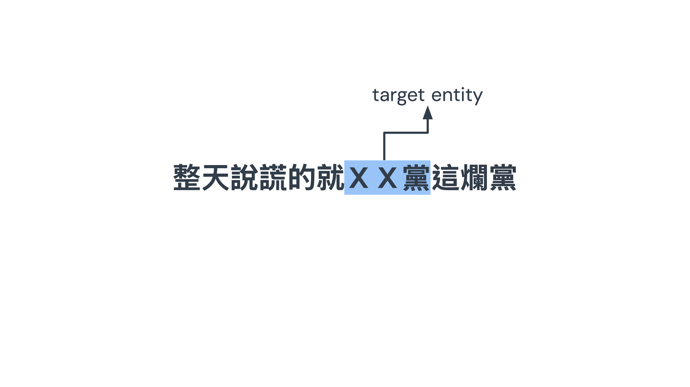
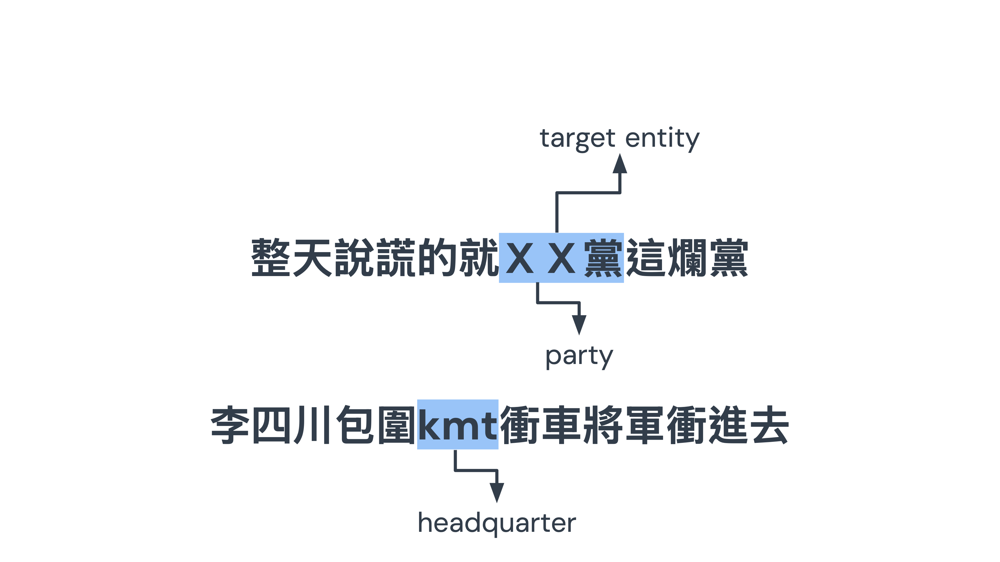
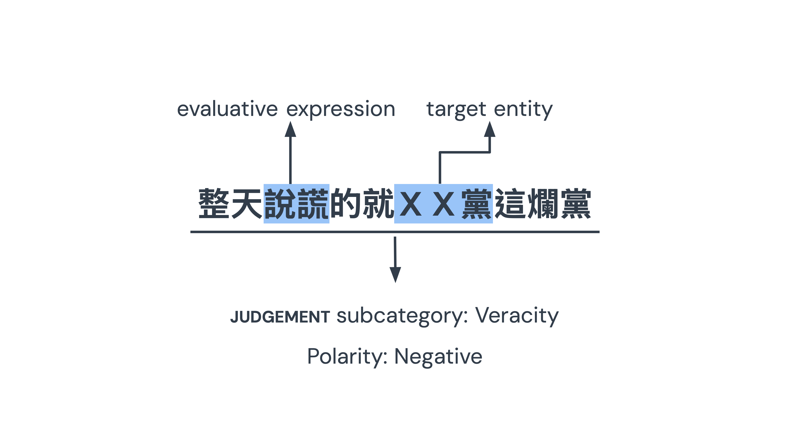

<!-- _class: lead -->

<!-- Good afternoon everyone. My name is Hao‑Yun Chuang from the Graduate Institute of Linguistics at NCCU. Today I will present my study Political Comment Opinion Analysis and Applications of Large Language Models: A Case Study of Social Media Comments on Taiwan’s 2024 Presidential Election.   -->

#### Political Comment Opinion Analysis and Applications of Large Language Models: A Case Study of Social Media Comments on Taiwan's 2024 Presidential Election

Hao-Yun Chuang  
Graduate Institute of Linguistics, NCCU  
18 November 2025

---
<!-- Let me begin with the nature of online political comments.  
On platforms like PTT, people like to discuss and criticize to the topics related to the politics, so political comments such as ‘腐化的Ａ黨’ are common. A 黨 in these comments function as cognitive shortcuts, shaping how people perceive entire parties rather than just individuals.  
These kinds of comment spread rapidly, are anonymous, grassroots in nature, and highly diverse. This makes them a rich source for analyzing the public opinion in the political discourse. -->
<!--_paginate: true-->
## Online political comment
- 「腐化的Ａ黨」→ political comment
- As an cognitive shortcut
→ people tend to evaluate political party (Gastil, 2014)
- Characteristics
  - Immediacy and rapid dissemination
  - Anonymity and grassroot nature
  - Diversity and large scale

---
<!-- Most NLP research has focused only on polarity — whether a comment is positive or negative.  
But It overlooks evaluative dimensions such as competence, honesty, or morality.  
My study argues that we need fine‑grained categories to understand how party are evaluted in the online political discourse.  -->

<!--_paginate: true-->
### Deeper understanding of the comment
- Most research in NLP mostly limit at polarity.
- Evaluative dimensions may be overlooked.
- More fine-grained categories of evaluations is needed.
- It help understand how political party's image is constructed and challenged

---

<!-- To address this, I adopt the Appraisal framework proposed by White in 2005. This framework, rooted in Systemic Functional Linguistics, analyzes how language conveys attitudes and evaluations. It provides structured categories that allow us to go beyond simple sentiment and capture nuanced dimensions in the evaluation. -->
<!--_paginate: true-->
### Appraisal framework (White, 2005)

- Derives from Systemic Functional Linguistics
- Analyzes how language conveys attitudes and evaluations in communication

---
<!-- Within the Appraisal framework, I focus on the subsystem of JUDGEMENT.  
It has five subcategories:

•  Capacity: competence, e.g. ‘Party A is incompetent’.
•  Propriety: morality, e.g. ‘Don’t vote for corrupt Party B’.
•  Veracity: honesty, e.g. ‘Party C always lies’.
•  Tenacity: determination, e.g. ‘Party D breaks promises’.
•  Normality: unusualness, e.g. ‘Party E acting strangely’.  
These distinctions allow us to see not just negativity, but *what kind* f negativity-->
<!--_paginate: true-->
## judgement & subcategories

<table style="width: 100%; text-align: center; border-collapse: collapse; font-size: 32px;">
  <tr style="background-color: #44A6D4; color: white;">
    <th>Subcategory</th>
    <th>What it Evaluates</th>
    <th>Example from PTT</th>
  </tr>
  <tr>
    <td>Capacity</td>
    <td>competence, intelligence</td>
    <td>A 黨無能！</td>
  </tr>
  <tr>
    <td>Propriety</td>
    <td>morality, ethics</td>
    <td>不投腐敗的B 黨！</td>
  </tr>
  <tr>
    <td>Veracity</td>
    <td>honesty, truthfulness</td>
    <td>整天說謊的就C 黨！</td>
  </tr>
  <tr>
    <td>Tenacity</td>
    <td>determination</td>
    <td>簽了又翻桌的D 黨！</td>
  </tr>
  <tr>
    <td>Normality</td>
    <td>unusualness</td>
    <td>E 黨願意才奇怪勒！</td>
  </tr>
</table>

---
<!-- Manual annotation of appraisal categories is very time‑consuming. Traditional machine learning models require retraining and lack flexibility. Large language models, however, are more context‑aware. By designing prompts, we can guide them to classify evaluative language automatically. I also implemented a visualization dashboard to make these evaluations accessible. -->
<!--_paginate: true-->
## Automated detection
- Manual annotation of Appraisal → low efficiency
- Non-generative model limitation → need to retrain
- More context-aware generative LLM → prompting
- Implementation: visualization of the evaluation

---
<!--My study addresses two main questions:

1.  How do Taiwanese social media users employ evaluative language through JUDGEMENT subcategories to express opinions toward political parties?
2.  How do different prompting strategies — zero‑shot versus few‑shot — influence GPT’s performance in classifying these subcategories?-->
<!--_paginate: true-->
## Research question

1. How do Taiwanese social media users employ evaluative language through judgement subcategories within the Appraisal framework to express opinions toward different political parties?
2. How do different prompting strategies (zero-shot vs. few-shot) influence the performance of GPT in classifying judgement subcategories?

---

## Literature review

---
<!--• the Appraisal framework divide evaluation into Attitude, Graduation, and Engagement. It also divides Attitude into AFFECT, JUDGEMENT, and APPRECIATION, which provides tools and fine-grained categories to systematically describe how people evaluate through language. to analyze the political discourse, JUDGEMENT is the most suitable, here's why” -->
<!--_paginate: true-->

## Appraisal framework
- Composed of attitude, engagement, and graduation.  
- Provides a tool to systematically describe how speakers or writers evaluate through language.  
- Commonly applied in different texts (e.g., politics, media, education)

---
<!-- Previous studies show that political comments often focus on behavior and character.  
In Chinese political contexts, JUDGEMENT has also proven to be especially relevant.  
because it captures accusations of dishonesty, incompetence, or moral failure.-->
<!--_paginate: true-->

## judgement in Political Discourse
- Political comments focus on target's behavior and character. (Zappavigna, 2017; Cavasso & Taboada, 2021)
- judgement is proven to be an appropriate resources in Chinese political context

---
<!-- As for the automated detection of appraisal, Earlier approaches relied on lexicons and rules, which struggled with dynamic online language.  
Deep learning models like BERT and RoBERTa improved performance, but still misclassified fine‑grained categories.  
Recent work with ChatGPT shows promise, but also frequent errors due to the classification of the whole categories in the framework. My study, therefore, investigates whether prompt engineering can improve classification under one category-->
<!--_paginate: true-->

## Automated Detection in Appraisal
- Traditional machine learning: relies on lexicons and rules, difficult to adapt to dynamic language (Casey et al., 2005)  
- Deep learning: BERT, RoBERTa show potential in ALTA Shared Task (Mollá, 2020; Aroyehun & Gelbukh, 2020)  
- ChatGPT applications (Imamovic et al., 2024): classify top-down, often misclassifies JUDGEMENT subcategories

---
<!-- My data comes from the PTT Gossiping board.  
I manually annotated comments for target entity, inscribed JUDGEMENT, polarity, and subcategory.  
Inter‑coder agreement was measured to ensure reliability.  
Then, I tested GPT with zero‑shot and few‑shot prompts, and built a visualization dashboard to display trends and word clouds. -->
<!--_paginate: true-->
## Methodology

- **Data:** PTT Gossiping board
- **Manual annotation**:
  * Target entity (metonymy identification)
  * Inscribed judgement
  * Polarity
  * Evaluative expression (text span)
- Intercoder agreement

---
<!--_paginate: true-->

<!-- for example -->

---
<!-- XX黨 is the target entity -->

---
<!-- this belongs to the negative evaluation of veracity -->

---
<!-- and the evaluative expression here is 說謊 -->

---
<!-- After annotation, GPT models were applied for automated classification.  
The outputs were integrated into a dashboard, allowing users to explore evaluations by party, subcategory, and time period. -->
<!--_paginate: true-->
## Automation

* GPT-based classification
* Visualization dashboard

---

# **Results**

---

<!-- The results show clear differences across parties.  
For the DPP, negative Propriety evaluations dominated.  
For the KMT, negative Capacity evaluations were most frequent.  
The TPP received far fewer evaluations overall, which may due to its newer presence. -->
<!--_paginate: true-->
#### Evaluative judgement Frequency

  <!-- Overall -->
  

    
DPP

    <table style="width: 100%; text-align: center; border-collapse: collapse;">
      <tr style="background-color: #44A6D4; color: white;">
        <th>Subcategory</th><th>+</th><th>−</th>
      </tr>
      <tr><td>capacity</td><td>6</td><td>19</td></tr>
      <tr><td>normality</td><td>0</td><td>9</td></tr>
      <tr><td>propriety</td><td>1</td><td>129</td></tr>
      <tr><td>tenacity</td><td>0</td><td>16</td></tr>
      <tr><td>veracity</td><td>6</td><td>33</td></tr>
      <tr style="font-weight: bold;"><td>Total</td><td colspan="2">213</td></tr>
    </table>
  

  <!-- KMT -->
  

    
KMT

    <table style="width: 100%; text-align: center; border-collapse: collapse;">
      <tr style="background-color: #44A6D4; color: white;">
        <th>Subcategory</th><th>+</th><th>−</th>
      </tr>
      <tr><td>capacity</td><td>5</td><td>52</td></tr>
      <tr><td>normality</td><td>0</td><td>1</td></tr>
      <tr><td>propriety</td><td>0</td><td>17</td></tr>
      <tr><td>tenacity</td><td>2</td><td>5</td></tr>
      <tr><td>veracity</td><td>0</td><td>7</td></tr>
      <tr style="font-weight: bold;"><td>Total</td><td colspan="2">89</td></tr>
    </table>
  

  <!-- TPP -->
  

    
TPP

    <table style="width: 100%; text-align: center; border-collapse: collapse;">
      <tr style="background-color: #44A6D4; color: white;">
        <th>Subcategory</th><th>+</th><th>−</th>
      </tr>
      <tr><td>capacity</td><td>0</td><td>3</td></tr>
      <tr><td>normality</td><td>0</td><td>0</td></tr>
      <tr><td>propriety</td><td>3</td><td>1</td></tr>
      <tr><td>tenacity</td><td>0</td><td>0</td></tr>
      <tr><td>veracity</td><td>0</td><td>2</td></tr>
      <tr style="font-weight: bold;"><td>Total</td><td colspan="2">9</td></tr>
    </table>
  

---
<!--_paginate: true-->
<!-- Statistical tests confirmed significant differences.  
For example, CAPACITY evaluations were 13 times more likely to target the KMT than the DPP.  
Meanwhile, PROPRIETY evaluations were 7 times more likely to target the DPP.  
These findings highlight distinct evaluative patterns. Moreover, DPP's negative propriety and KMT's negative capacity all show dominant number in contributing the significance in the statistical test.-->
#### Fisher's Test: judgement subcategories

  <table style="width: 100%; text-align: center; border-collapse: collapse;">
    <tr style="background-color: #44A6D4; color: white;">
      <th rowspan="2">Subcategory</th>
      <th colspan="2">KMT vs TPP</th>
      <th colspan="2">KMT vs DPP</th>
      <th colspan="2">TPP vs DPP</th>
    </tr>
    <tr style="background-color: #44A6D4; color: white;">
      <th>OR</th><th><em>p</em></th>
      <th>OR</th><th><em>p</em></th>
      <th>OR</th><th><em>p</em></th>
    </tr>
    <tr><td>capacity</td><td>3.563</td><td>0.086</td><td>13.395</td><td>0.000***</td><td>3.760</td><td>0.090</td></tr>
    <tr><td>normality</td><td>inf</td><td>1.000</td><td>0.258</td><td>0.291</td><td>0.000</td><td>1.000</td></tr>
    <tr><td>propriety</td><td>0.295</td><td>0.095</td><td>0.151</td><td>0.000***</td><td>0.511</td><td>0.489</td></tr>
    <tr><td>tenacity</td><td>inf</td><td>1.000</td><td>1.051</td><td>1.000</td><td>0.000</td><td>1.000</td></tr>
    <tr><td>veracity</td><td>0.299</td><td>0.192</td><td>0.466</td><td>0.093</td><td>1.558</td><td>0.636</td></tr>
  </table>

---
<!--_paginate: true-->
<!-- Comparing zero‑shot and few‑shot prompting, few‑shot consistently outperformed zero‑shot.  
Overall, the weighted F1 score rose from 0.80 to 0.89. -->
#### Classification Report

  <table style="width: 100%; text-align: center; border-collapse: collapse;">
    <colgroup>
      <col style="width: 14%;">
      <col style="width: 12%;">
      <col style="width: 12%;">
      <col style="width: 12%;">
      <col style="width: 12%;">
      <col style="width: 12%;">
      <col style="width: 12%;">
    </colgroup>
    <tr style="background-color: #44A6D4; color: white;">
      <th rowspan="2">Subcategory</th>
      <th colspan="3">Zero-shot</th>
      <th colspan="3">Few-shot</th>
    </tr>
    <tr style="background-color: #44A6D4; color: white;">
      <th>Precision</th><th>Recall</th><th>F1</th>
      <th>Precision</th><th>Recall</th><th>F1</th>
    </tr>
    <tr><td>capacity</td><td>0.71</td><td>0.84</td><td>0.77</td><td>0.85</td><td>0.84</td><td>0.84</td></tr>
    <tr><td>normality</td><td>0.29</td><td>0.50</td><td>0.37</td><td>0.50</td><td>0.90</td><td>0.64</td></tr>
    <tr><td>propriety</td><td>0.90</td><td>0.92</td><td>0.91</td><td>0.96</td><td>0.90</td><td>0.93</td></tr>
    <tr><td>tenacity</td><td>1.00</td><td>0.13</td><td>0.23</td><td>0.78</td><td>0.91</td><td>0.84</td></tr>
    <tr><td>veracity</td><td>0.94</td><td>0.81</td><td>0.87</td><td>0.98</td><td>0.95</td><td>0.96</td></tr>
    <tr style="font-weight: bold; background-color: #f0f0f0;">
      <td>Macro Avg</td>
      <td>0.77</td><td>0.64</td><td>0.63</td>
      <td>0.81</td><td>0.90</td><td>0.84</td>
    </tr>
    <tr style="font-weight: bold; background-color: #f0f0f0;">
      <td>Weighted Avg</td>
      <td>0.84</td><td>0.81</td><td>0.80</td>
      <td>0.90</td><td>0.89</td><td>0.89</td>
    </tr>
  </table>

---
<!-- McNemar test confirmed that the improvement was statistically significant.  
Few‑shot prompting corrected many errors that zero‑shot had made, showing the value of carefully designed prompts.” -->
<!--_paginate: true-->
## McNemar Test

<table style="width: 70%; text-align: center; font-size: 27px; border-collapse: collapse; margin: auto;">
  <thead>
    <tr style="background-color: #44A6D4; color: white;">
      <th style="padding: 10px;"></th>
      <th style="padding: 10px;">Few-shot Correct</th>
      <th style="padding: 10px;">Few-shot Incorrect</th>
    </tr>
  </thead>
  <tbody>
    <tr>
      <td style="padding: 10px;">Zero-shot Correct</td>
      <td style="padding: 10px;">258</td>
      <td style="padding: 10px;">9</td>
    </tr>
    <tr>
      <td style="padding: 10px;">Zero-shot Incorrect</td>
      <td style="padding: 10px;">38</td>
      <td style="padding: 10px;">25</td>
    </tr>
    <tr>
      <td style="padding: 10px;"><em>McNemar χ²</em></td>
      <td style="padding: 10px;">–</td>
      <td style="padding: 10px;">16.68</td>
    </tr>
    <tr>
      <td style="padding: 10px;"><em>McNemar p-value</em></td>
      <td style="padding: 10px;">–</td>
      <td style="padding: 10px;">0.00044***</td>
    </tr>
  </tbody>
</table>

---

# **Discussion**

---
<!--If we look at the evaluation of negative propriety the whole year, we can find two spike that close to each other. So we will focus on these two spike, which is around June to August -->
### DPP: Negative Evaluation of propriety

<iframe
	src="https://publicopiniondashboard-milanochuang.streamlit.app/?section=trend_line&embedded=true&scale=1&scroll=220"
	width="1200"
	height="800"
	style="border:0; max-width:100%; aspect-ratio:16/9;"
	loading="lazy"
></iframe>

---

<!-- To see exactly how dpp is evaluate, we can adjust the panel from June to August -->
<iframe
  src="https://publicopiniondashboard-milanochuang.streamlit.app/?section=wordcloud&embedded=true&scale=1"
  width="1200"
  height="800"
  style="border:0;max-width:100%;aspect-ratio:16/9;"
  loading="lazy">
</iframe>

---
<!--_paginate: true-->
<!-- Negative evaluations of the DPP’s Propriety spiked in June and August.  
As we can see from the previous slides, Key terms have included dictatorship, misogyny, corruption, and trash.  
These were linked to Lai’s ‘democracy vs dictatorship’ statement, people refute that dpp is the one who is dictator. Worth to note that because of the #MeToo movement was under the spotlight at that time, though may not be directly related to metoo movement, as long as it's propriety-related issue, people also like to raise questions about the DPP’s handling of gender issues altogether. -->
### DPP: Negative Evaluation of propriety
- **Spikes in criticism**: June & August  
- **Key evaluative terms**:  
專制 'dictatorship', 厭女 'misogyny', 貪污 'corruption'
- **Triggering events**:  
  - Lai's "democracy vs dictatorship" → backlash  
  - DPP accused of misogyny → counter against DPP  
- **Gender issues intertwined**: sexual harassment, assault, rape linked to \#MeToo discourse

---
<!-- This scandal is against societal expectations about dpp because dpp brands itself on progressive value. However, this scandal may create credibility gap for people, which is harder to repair, and might cause stronger erosion of legitimacy and voter support -->
<!--_paginate: true-->

### DPP: Negative Evaluation of propriety
- DPP against societal expectations  
- Party's progressive value → credibility gap  
- **Impact**:  
  - propriety damage harder to repair
  - Stronger erosion of legitimacy and voter support

---

<!--If we look at the evaluation of negative capacity the whole year for kmt, we can find the highest spike around April. So next we will focus on this spike-->
### KMT: Negative Evaluation of capacity

<iframe
	src="https://publicopiniondashboard-milanochuang.streamlit.app/?section=trend_line&embedded=true&scale=1&scroll=220"
	width="1200"
	height="800"
	style="border:0; max-width:100%; aspect-ratio:16/9;"
	loading="lazy"
></iframe>

---

<!-- To see exactly how dpp is evaluate, we can adjust the panel from June to August. we can see terms like 內鬥智障 in the word cloud, so -->
<iframe
  src="https://publicopiniondashboard-milanochuang.streamlit.app/?section=wordcloud&embedded=true&scale=1"
  width="1200"
  height="800"
  style="border:0;max-width:100%;aspect-ratio:16/9;"
  loading="lazy">
</iframe>

---
<!--_paginate: true-->
<!-- 
Terms like infighting and useless reflected frustration with delays in candidate selection and visible intra‑party conflict.  
These evaluations framed the KMT as organizationally incompetent -->
### KMT: Negative Evaluation of capacity
- Spikes in criticism: April peak, November rise
- Key evaluative terms:  
內鬥 'infight', 智障 'stupid', 無能 'useless'
- Triggering events:
  - Candidate selection delays → frustration
  - Visible intra‑party conflict → loss of unity
- Organizational issues: poor decision‑making efficiency, weak coordination

---
<!--  -->
### GPT Prompt Setting: Error Analysis

---

<!-- Zero-shot models often confuse similar subcategories — for example, interpreting tenacity as capacity or normality as propriety.
With few-shot prompting, the model learns semantic cues that help it make finer distinctions.
As a result, tenacity is correctly identified in 14 out of 16 cases, and normality in 3 out of 4, showing that targeted examples can significantly improve classification. -->
### Few-shot Improves Classification

- Zero-shot models often confuse subcategories (tenacity → capacity, normality → propriety). 
- Few-shot prompting provides semantic cues, significantly improving classification accuracy.
- Results: tenacity corrected in **14/16** cases, normality corrected in **3/4** cases.

---
<!--_paginate: true-->
<!-- However, Even with few-shot prompting, some misclassifications remain.
The most common errors are confusing propriety with capacity — 10 out of 15 times — and capacity with normality — 6 out of 14 times.
These cases show that evaluative expression are still hard for the model to capture precisely. So let's look closely at theses errors. -->
### Few-shot: Error Analysis

- Even with few-shot prompting, some misclassifications remain frequent.  
- Two major error types:  
	- propriety → capacity (10/15 cases)  
	- capacity → normality (6/14 cases)

---
<!--_paginate: true-->
<!-- Here, the model often mistakes propriety for evaluations of capacity.
For example: “民進黨的國家機器真有夠噁爛”
The gold label is propriety, because it criticizes the unethical use of state power in the context of the democratic country. Becasue the word state appratus itself means the manipulative power of the government, the model predicts capacity, interpreting it as a comment on competence.
This reflects how political language can confuse without knowing the context of the data, making classification challenging. -->
#### Error Type 1: propriety → capacity

**Example (12)**  
Gold: propriety
Predicted: capacity

(12) **民進黨的國家機器真有夠噁爛**
&emsp;&emsp;**"The DPP's state apparatus is truly disgusting."**
- Issue: Model reads "state apparatus" as an incompetent actor rather than a morally illegitimate practice.  
- Insight: Domain-specific prompts could help emphasize how political context shifts evaluative meaning.

---
<!--_paginate: true-->
<!-- Another recurring error is reading capacity as normality.
For example: “國民黨內部一片混亂” the gold label is CAPACITY because 一片混亂 ‘utter chaos’ evaluates the party’s managerial incompetence, but the model misclassified it as NORMALITY, interpreting it as a deviation from order. Since such expressions in political contexts often signal inability rather than mere abnormality, domain-specific prompts could help reduce this ambiguity.-->
#### Error Type 2: capacity → normality

**Example (13)**  
Gold: capacity  
Predicted: normality

(13) **國民黨內部一片混亂**
&emsp;&emsp;**"The KMT is in utter chaos internally."**
- Issue: Model interprets the phrase as norm deviation rather than inability to manage internal affairs.  
- Insight: More domain-tailored examples could clarify the boundary.

---
<!--_paginate: true-->
<!-- This study has limitations: keyword‑based data may introduce bias, sarcasm and irony were excluded, and only inscribed evaluations were analyzed.  
Nevertheless, the findings show that: commenters tend to evaluate the organizational ability of the party as the ability to govern the country, while commenters also tend to evaluate how party handle scandals to see if the party is morally legitimate enough to govern.
This demonstrates the potential of large language models to assist in political discourse analysis, while also highlighting the need for domain‑specific prompt design.” -->
### Limitation & Conclusion
- Limitations:
  - Keyword-based dataset → possible selection bias
  - Exclusion of sarcasm/irony
- Capacity to govern vs. Propriety to govern
- Evaluative expressions reshape the political image
- Classification experiments:
  - Few-shot prompting improved performance.
  - Need prompts enriched with domain-oriented knowledge.

---

# **Thank you!**